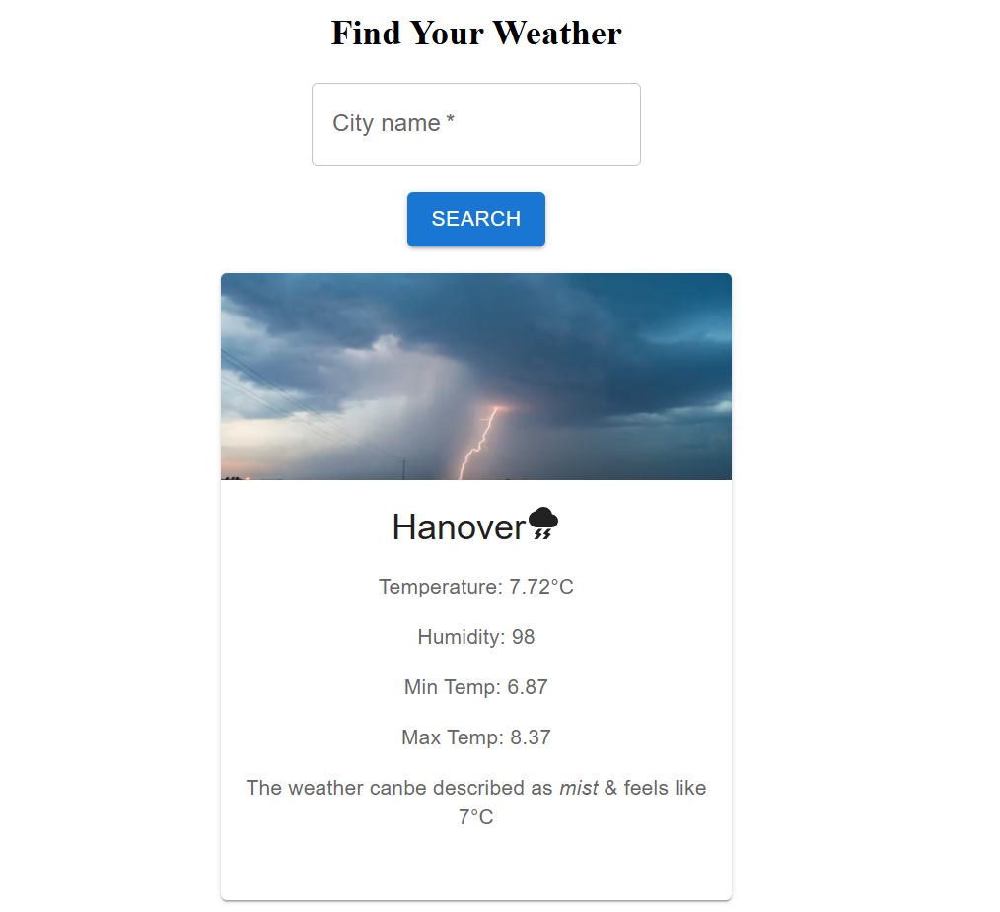

# Weather App Using React & Weather API
## Intro:
This is built just to practice some of react topics like useState hook, useEffect and little bits of material UI. An weather API(openweather API) is also used to fetch weather related datas based on city name. 
### Feature:
This app can tell the weather condition of a specific city. If the city dosen't exist, it can show an error message as well.
## Installation
- Firstly, clone the repository into your local machine.
  ```bash
  git clone https://github.com/MdMahdiHasanTazelly/Weather_App

- Navigate to Project's root directory & install all the dependencies
  ```bash
  cd directory_name
  npm install

- Now, start the server
  ```bash
  npm run dev

Click the generated URL & check it out.

## Screenshot
You can simply put a city name is the search box and it'll return you the weather condition.
<br/><br/>
